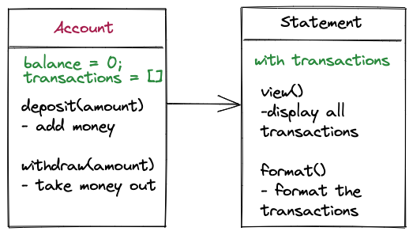

# Bank Tech Test

This is a small project designed to practice a tech test.

## Description

User Story:

```
As a client,
So I can manage my bank account,
I want to make a deposit.

As a client,
So I can manage my bank account,
I want to withdraw money

As a client,
So I can manage my bank account,
I want to know the balance

As a client,
So I can track my transactions,
I want to see the bank statement
```

## Running the program

1. Fork this repository and Clone your fork to your local machine
2. Install Node.js dependencies

```
npm install
```

3. Start node in your console:

```
node
```

4. Run the program
   To make transactions

```
const Account = require('./src/account')
const account = new Account()

account.deposit(1000)
account.withdraw(500)
account.deposit(2000)
```

To print statement

```
const Statement = require('./src/statement')
const statement = new Statement(account.transactions)
statement.print()
```

## Testing and coverage

```
jest --coverage
```

## Approach



- Attempted OOD and TDD to maintain good code quality
- Recompiled the given requirements into the user story before implementation.
- An account can make deposit or withdrawal transaction and the transactions are stored.
- The stored transactions are formatted and printed in statement class.

## Specification

### Requirements

- You should be able to interact with your code via a REPL like IRB or Node. (You don't need to implement a command line interface that takes input from STDIN.)
- Deposits, withdrawal.
- Account statement (date, amount, balance) printing.
- Data can be kept in memory (it doesn't need to be stored to a database or anything).

### Acceptance criteria

**Given** a client makes a deposit of 1000 on 10-01-2023  
**And** a deposit of 2000 on 13-01-2023  
**And** a withdrawal of 500 on 14-01-2023  
**When** she prints her bank statement  
**Then** she would see

```
date || credit || debit || balance
14/01/2023 || || 500.00 || 2500.00
13/01/2023 || 2000.00 || || 3000.00
10/01/2023 || 1000.00 || || 1000.00
```
